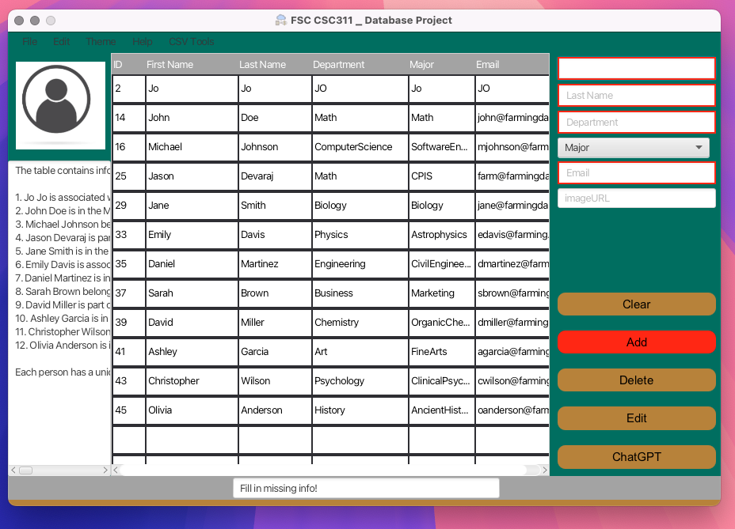

<h1 align="center">Module 07 Assignment</h1>

## 🚀 Features and Touch-Ups
- "Edit" and "delete" disabled unless a record is selected
- "Add" enabled only if form is correct
- Menu item's can be greyed out
- Field validation using regex
- "Major" field has a dropdown menu 
- User feedback status bar
- Import and Export CSV
- Thread Safety in UserSession Class
- Signup page functionality
- Record username and password
- Touch ups: 
  - App Branding (Farmingdale Registrar Office)
  - Adding a Menu Page to go to various menus 
  - Integration with Chat-GPT to give a summary of the observable list
  - Support Page
- Bonus
  - PDF generation of a report
  - Row management: add a new row by clicking on the next empty row
  - Allow editing within the selected table view row 

## 🧰 Tech Stack and Libraries

## 📝 License
This project uses the MIT License. 